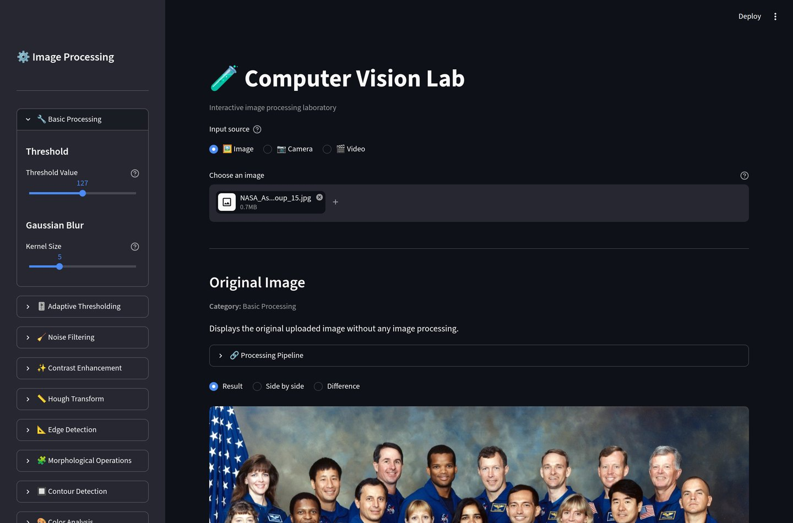
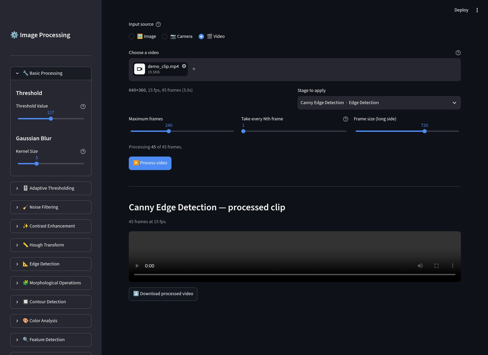
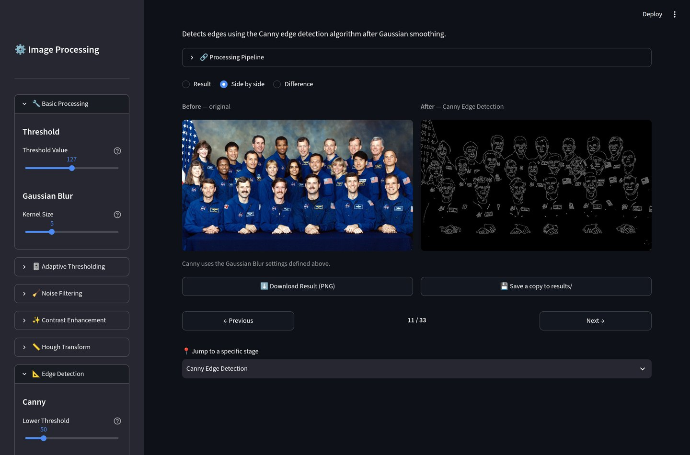
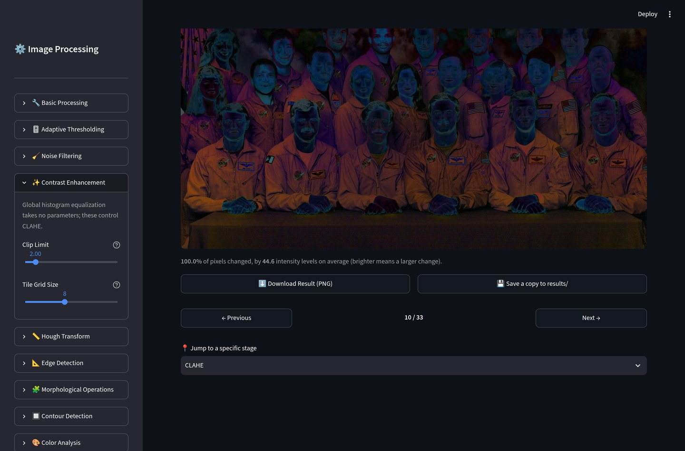
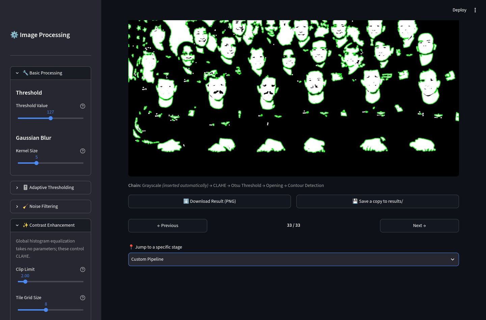
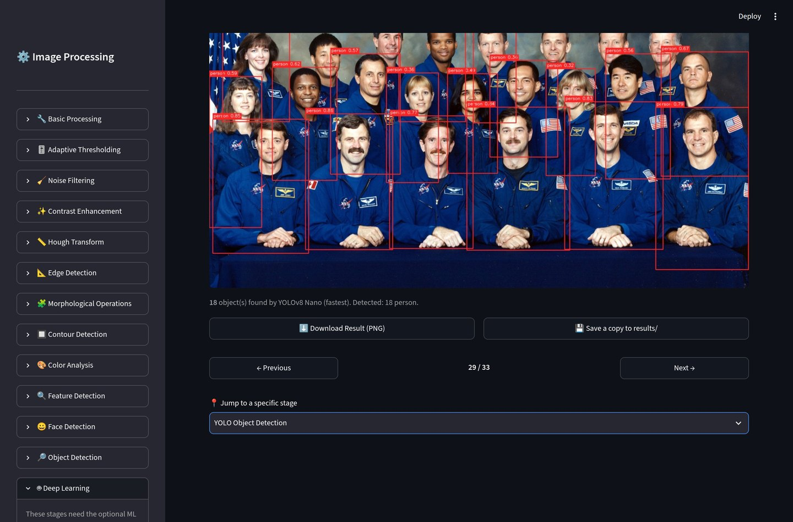

# 🧪 Computer Vision Lab

[](https://github.com/mustafarici/computer-vision-lab/actions/workflows/tests.yml)
[](LICENSE)

An interactive computer vision and image processing laboratory built with **Python**, **OpenCV**, **NumPy**, **Pillow**, **Matplotlib** and **Streamlit** — with optional deep-learning stages powered by **YOLOv8** and **MediaPipe**.

33 processing stages, from a grayscale conversion up to a neural network detecting 80 object classes, each with its own controls and a short explanation of what it does and why. Feed it a photo, a webcam snapshot, or a video clip.

<!-- Once deployed to Streamlit Community Cloud (see "Deploying" below),
     replace this comment with:
     **▶️ [Try it live](https://computer-vision-lab.streamlit.app/)** -->



---

## 🚀 Running it

```bash
pip install -r requirements.txt
streamlit run app.py
```

The two deep-learning stages are optional, because they pull in PyTorch and MediaPipe's runtime:

```bash
pip install -r requirements-ml.txt
python scripts/fetch_models.py   # optional: download the weights up front
```

Without them the app runs exactly as before — those two stages just show an install hint instead of a result.

---

## ✨ Features

### 📥 Three ways in

**Image** — upload a JPG or PNG. Large images are downscaled (long side capped at 1920px, aspect preserved) so nothing chokes on a 20MP photo, and both resolutions are reported when that happens.

**Camera** — take a snapshot from the webcam and process it in place. The frame goes to whatever machine is running the app — your own when running locally, the host's when deployed — and is held in memory rather than written anywhere.

**Video** — run any stage over every frame of a clip. A still image tells you what an operation does; a video tells you whether it holds up — detection that flickers between frames, or a threshold tuned for exactly one lighting condition, is invisible in a single frame and obvious in a few seconds of footage.



Frame size, frame count and sampling stride are all capped, and the exact plan ("processing 240 of 1,431 frames, covering the first 9.6s") is stated *before* any work starts rather than discovered afterwards.

### 🔍 Before / after / difference

Every stage that returns an image the same size as the input can be viewed three ways: the result on its own, the original next to it, or the per-pixel difference between them.



The difference view also quantifies what changed — the share of pixels the stage touched, and by how much on average. Those two numbers say different things: a contrast tweak nudges every pixel a little, a threshold rewrites most of them completely.



### 🧬 Custom pipelines

Every other stage starts from the original image, which is the right shape for learning one operation at a time and the wrong shape for the moment you want to ask "what if I equalize the contrast *first*, then threshold, then close the gaps?"

The Custom Pipeline stage lets you chain operations in whatever order you click them. Any grayscale conversion or threshold a step needs is inserted automatically, and the chain that actually ran is printed underneath the result — so there are no invalid combinations to discover, and no guessing about what the app silently did on your behalf.

A chain borrows its settings from the sections its steps came from rather than duplicating every slider, so the sidebar opens exactly those sections: pick CLAHE and Opening and you get the CLAHE and morphology controls, without being told to go and find them.



### 🖼️ Processing stages

**Basic** — Grayscale conversion, fixed-threshold binarization, Gaussian blur

**Thresholding** — Otsu's method (picks the threshold from the histogram automatically), adaptive thresholding (a separate threshold per neighbourhood, for unevenly lit images)

**Noise Filtering** — Median filter (removes salt-and-pepper noise), bilateral filter (edge-preserving smoothing)

**Contrast Enhancement** — Histogram equalization, CLAHE (contrast limited adaptive histogram equalization)

**Edge Detection** — Canny, Sobel, Laplacian

**Morphology** — Erosion, dilation, opening, closing

**Contours** — Contour detection with retrieval-mode, approximation-method and minimum-area controls

**Hough Transform** — Line and circle detection

**Color Analysis** — RGB channel separation, HSV channel separation, HSV-range color masking and thresholding

**Feature Detection** — Harris corners, ORB keypoints

**Classical Object Detection** — Face detection and multi-class detection (eyes, smile, full body, cat face, license plate) via Haar Cascades

**Deep Learning** *(optional)* — YOLOv8 object detection across 80 COCO classes with confidence and NMS controls; MediaPipe landmarks for a 468-point face mesh, 21-point hand skeletons, or 33-point body pose



**Histogram Analysis** — Grayscale histogram with mean/median/min/max statistics, and a per-channel color histogram

**Pipeline** — the chain builder described above

### 🎛️ Interactive controls

Controls are declared as data in `modules/controls.py` and grouped into collapsible sidebar sections. The section belonging to whatever stage is on screen opens automatically; the rest stay collapsed, so you're not scrolling past Hough parameters while tuning a blur.

Every parameter updates the result immediately. Stages that need a color image show a clear explanation rather than an error when a grayscale-only image is uploaded, and Canny warns you if the lower/upper thresholds are inverted while still computing a sensible result.

### 🧭 Navigation

- Previous / Next navigation and a "Jump to a specific stage" dropdown
- Live stage counter
- Each stage shows its category, a short description, and an expandable "Processing Pipeline" breakdown
- **Download** any result as a PNG, or **save a copy to `results/`** directly when running locally

---

## ⚡ Performance

- **Lazy stage evaluation**: only the stage currently displayed is computed on each rerun. Stages that never touch the grayscale conversion (Original, RGB/HSV Channels, Color Mask/Threshold, the filters, YOLO, MediaPipe) skip it entirely.

- **Measured caching policy.** `@st.cache_data` isn't free: it hashes the full input array (~6 MB for a 1920×1080 image) and copies the result back out, costing ~1.5–2.5 ms per call. So caching is applied only where benchmarks showed it wins:

  | Operation | Raw compute | Cache hit | Cached? |
  |---|---|---|---|
  | Grayscale / threshold / blur / morphology | 0.1–0.6 ms | ~1.5–2 ms | ❌ cache cost more than the work |
  | Canny / Sobel / contours | 16–21 ms | ~1.5 ms | ✅ |
  | Harris / ORB / color thresholding | 28–92 ms | ~2–4 ms | ✅ |
  | Bilateral filter / Hough / CLAHE | 10–200 ms | ~2–4 ms | ✅ |
  | Haar Cascade detection | ~700 ms | ~2 ms | ✅ |
  | PNG encoding for the download button | ~46 ms | ~2.6 ms | ✅ |

- **Bounded caches**: every cache sets `max_entries`, so dragging a slider can't accumulate one full-size image per position. (Previously, sweeping the 0–255 threshold slider alone could cache ~500 MB of images.)

- **Caching is a property of the call site, not the function.** The same measurement that justifies caching Canny from a slider condemns it inside a video loop: every frame is a different array, so every lookup misses while still paying to hash a 1.5 MB frame and copy the result back. Measured over 60 frames of 720p:

  | | Total | Per frame |
  |---|---|---|
  | With `@st.cache_data` | 792 ms | 13.2 ms |
  | With caching bypassed | 606 ms | 10.1 ms |

  So `modules/caching.py` makes the decision per call, and the video path runs inside `caching_disabled()` — **31% faster**, identical output.

- **Bounded video work**: frame size, frame count and stride are capped before processing rather than after, so a long clip degrades into a shorter preview instead of an unresponsive page. Each session gets one scratch directory that is cleared between runs, and directories left by sessions that ended are swept — otherwise a 200 MB upload cap and a long-running server are a disk-exhaustion bug waiting to happen.

- **No figure leak**: histograms are built with matplotlib's object-oriented `Figure` rather than `plt.subplots()`, which would keep every figure ever rendered alive in pyplot's global registry — one per rerun.

- **Models loaded once**: Haar Cascades, YOLO weights and MediaPipe models are cached with `@st.cache_resource`, so they're read once per session rather than on every interaction.

---

## 🧪 Tests

```bash
pip install -r requirements-dev.txt
pytest
```

664 tests covering the image operations themselves (threshold boundaries, morphology growing/shrinking the foreground, Otsu landing between two intensity clusters, bilateral filtering preserving an edge, contour area filtering, PNG round-trips), parameter validation, video framing and encoding, the sidebar schema, and every stage handler end-to-end. The sidebar is exercised through Streamlit's own `AppTest`, so a broken widget fails a test rather than only the running app.

The pipeline builder is tested over **every ordered pair of operations**, because "does this chain work" is a question about combinations, not about individual functions — an operation that quietly rejects a 3-channel array is only wrong in the orderings that hand it one.

A few tests assert about the *installed environment* rather than about this code, because the two most expensive bugs in this project's history were both of that shape: a dependency quietly resolving to OpenCV 5 (which removed `cv2.CascadeClassifier`), and MediaPipe installing cleanly on a machine with no OpenGL ES runtime, then failing hundreds of lines deep with `libGLESv2.so.2: cannot open shared object file`. Neither is visible to an import check, and the second one used to take the whole page down rather than one stage — now it reports which system package is missing.

The UI is tested too, through Streamlit's `AppTest`: every stage is rendered, the comparison modes are switched, the navigation buttons are clicked. Line coverage is **91%**.

CI runs four jobs on every push:

| Job | What it covers |
|---|---|
| `tests (core deps)` | Python 3.11 and 3.13, base requirements only, with a coverage report. Needs no system packages at all, so it can't be held up by an Ubuntu mirror |
| `tests (optional ML deps)` | The same suite with `ultralytics` and `mediapipe` really installed, so the YOLO and MediaPipe code paths run for real rather than only their "not installed" branch |
| `tests (ML deps, no system libraries)` | The ML packages installed and the OpenGL libraries deliberately left out. It doesn't check that everything works — it checks that the app names what's missing and keeps its other 32 stages running |
| `ruff` | Lint |

That third job exists because both of this project's production breakages were environmental and both shipped green: OpenCV 5 removing `cv2.CascadeClassifier`, and MediaPipe needing an OpenGL ES runtime that `pip install` doesn't provide. In a working environment there is nothing to detect, so CI builds a broken one on purpose. Dependabot opens the dependency bumps that caused them, weekly, as pull requests with those checks attached.

Locally, the same lint runs before each commit:

```bash
pre-commit install
```

---

## 🔬 Processing Pipeline

```text
                                 Input Image
                                      │
              ┌───────────────────────┼───────────────────────┐
              ▼                       ▼                       ▼
         Grayscale            RGB / HSV Channels      Median / Bilateral
              │                       │                    Filtering
   ┌──────────┼───────────┐           ▼
   │          │           │    Color Thresholding
   │          │           │      (Mask + Result)
   │          │           │
   │          │           ├──► Otsu / Adaptive Threshold
   │          │           ├──► Histogram Equalization / CLAHE
   │          │           ├──► Sobel / Laplacian
   │          │           ├──► Harris Corners / ORB Keypoints
   │          │           ├──► Haar Cascade (faces, objects)
   │          │           └──► Histogram
   │          ▼
   │      Gaussian Blur
   │          │
   │          ▼
   │       Canny Edge ──────► Hough Lines
   │       Detection
   ▼
Binary Image
   │
   ├───────────┬────────────┬────────────┐
   ▼           ▼            ▼            ▼
Erosion    Dilation      Opening      Closing
   │
   ▼
Contour Detection

(The original image also feeds YOLO and MediaPipe directly — neural
networks take the color image, not a preprocessed one. The Custom
Pipeline stage ignores this diagram entirely: it runs whatever chain
you build, in whatever order you build it.)
```

---

## 🔒 Notes on running this in public

The app is designed to be safe to deploy, which is a different bar from being safe to run on your own laptop:

- **Uploaded filenames are treated as hostile.** A filename is not a name, it's whatever the client sent — `../../app.py` included. Uploads are written under a sanitized single path segment inside a per-session directory, and the write is refused outright if the resolved path would land anywhere else. On a hosted deployment the application directory is writable and Streamlit reloads on file change, so an arbitrary write is a short walk from arbitrary code execution.
- **Temporary files are cleaned up.** One scratch directory per session, cleared between runs, and directories left behind by sessions that ended are swept on the way in.
- **"Save a copy to `results/`" is hidden when the app isn't running locally**, where it would write into the server's ephemeral filesystem for a file the user can't reach. Set `CVLAB_HOSTED=1` to force that behaviour anywhere.
- **The camera widget doesn't overclaim.** The snapshot goes to whatever machine is running the app — this laptop locally, someone else's server when deployed — and the help text says so.
- **Model weights are loaded from a fixed table only.** YOLO `.pt` files are pickles, so `torch.load` on an arbitrary one is remote code execution. If you ever add "upload your own model", that's the line you'd be crossing.

---

## ☁️ Deploying

The repository is ready for [Streamlit Community Cloud](https://share.streamlit.io) as-is:

- `requirements.txt` pins every dependency below its next major release
- `packages.txt` contains one line, `ffmpeg`, for the video stage. The app asks for `opencv-python-headless`, which links against no GUI libraries — a Streamlit app never opens a window, so the GUI half of OpenCV is dead weight that drags in libGL, glib and GTK.

  Note that `packages.txt` takes **bare package names only**. Streamlit Cloud pipes the file straight into `apt-get install` through `xargs`, so a `#` comment isn't ignored — it becomes a list of imaginary packages and the deploy fails before any Python runs. `tests/test_packaging.py` enforces that.

  If you move the optional ML dependencies into a deployment, add `libgl1`, `libglib2.0-0`, `libegl1` and `libgles2`: MediaPipe depends on `opencv-contrib-python` (the GUI build) and its native library needs the OpenGL ES runtime.
- `.streamlit/config.toml` gives the deployed app the same theme as the local one

Point Streamlit Cloud at this repository with `app.py` as the entry point. The optional ML dependencies are deliberately left out of `requirements.txt`, so the deployed app starts fast and the two deep-learning stages show their install hint; move them across if you want YOLO in the hosted version too.

---

## 📅 Development Roadmap

- [x] Project setup, GitHub repository, Streamlit application
- [x] Image upload and grayscale conversion
- [x] Histogram analysis and image thresholding
- [x] Gaussian blur, Canny / Sobel / Laplacian edge detection
- [x] Interactive sidebar controls and image navigation
- [x] Morphological operations and contour detection
- [x] RGB / HSV analysis and color thresholding
- [x] Feature detection (Harris corners, ORB keypoints)
- [x] Face detection and multi-class object detection (Haar Cascade)
- [x] Modular architecture with a stage registry and declarative sidebar
- [x] Test suite and continuous integration
- [x] Otsu and adaptive thresholding
- [x] Median and bilateral filtering
- [x] Histogram equalization and CLAHE
- [x] Hough line and circle detection
- [x] Color histogram
- [x] YOLOv8 object detection
- [x] MediaPipe face mesh, hands and pose
- [x] Before / after / difference comparison
- [x] Chained custom pipelines
- [x] Video and webcam input
- [x] Linting, pre-commit hooks, and CI coverage for the optional ML stages
- [x] Security review: upload path sanitizing, temp cleanup, honest privacy wording
- [x] UI layer split out of app.py, tested through `AppTest`

### 🔭 Possible next steps

- Stages that take two images: template matching, ORB feature matching, image blending
- Segmentation: watershed, K-means color quantization, GrabCut
- Saving and sharing a custom pipeline as a preset
- Training and running a custom model instead of only pre-trained ones

---

## 🛠️ Technologies

- 🐍 **Python**
- 👁️ **OpenCV**
- 🌐 **Streamlit**
- 🔢 **NumPy**
- 🖼️ **Pillow**
- 📊 **Matplotlib**
- 🤖 **Ultralytics YOLOv8** *(optional)*
- ✋ **MediaPipe** *(optional)*

---

## 📂 Project Structure

```text
computer-vision-lab/
│
├── app.py                    # Streamlit entry point: config, input source, dispatch
├── LICENSE
├── requirements.txt          # Core dependencies
├── requirements-ml.txt       # Optional: YOLO + MediaPipe
├── requirements-dev.txt      # Optional: pytest, ruff, pre-commit
├── packages.txt              # apt packages for Streamlit Cloud
├── ruff.toml
├── pytest.ini
├── .pre-commit-config.yaml
├── README.md
├── .gitignore
│
├── .github/
│   ├── workflows/            # CI: tests, optional-ML, degraded-environment, lint
│   └── dependabot.yml
├── .streamlit/               # Theme and server config
├── assets/                   # Screenshots used by this README
├── images/                   # Sample images used for local testing
├── scripts/
│   └── fetch_models.py       # Pre-download the optional model weights
├── modules/                  # All processing logic, one file per topic
│   ├── __init__.py
│   ├── stages.py             # Stage registry: metadata + handler per stage
│   ├── controls.py           # Declarative sidebar schema
│   ├── pipeline.py           # Chainable operations + the chain runner
│   ├── compare.py            # Before/after and difference views
│   ├── video.py              # Frame-by-frame video processing
│   ├── workspace.py          # Per-session scratch space, upload sanitizing
│   ├── caching.py            # Cache decorator that a caller can switch off
│   ├── image_utils.py        # Shared shape/representation helpers
│   ├── io_utils.py
│   ├── basic_ops.py
│   ├── thresholding.py
│   ├── filters.py
│   ├── enhancement.py
│   ├── edges.py
│   ├── morphology.py
│   ├── contours.py
│   ├── hough.py
│   ├── color_analysis.py
│   ├── color_threshold.py
│   ├── feature_detection.py
│   ├── face_detection.py
│   ├── object_detection.py
│   ├── deep_detection.py     # YOLO + MediaPipe (optional dependencies)
│   └── histogram.py
├── views/                    # The UI layer; no image processing lives here
│   ├── image_view.py
│   ├── video_view.py
│   └── navigation.py
├── tests/                    # pytest suite
├── models/                   # Downloaded model weights (git-ignored)
└── results/                  # Locally saved processing results
```

### Adding a new stage

1. Write the operation in a module under `modules/` (or add it to a fitting one).
2. Add a handler and a `Stage(...)` entry in `modules/stages.py`.
3. If it needs parameters, add `Control(...)` entries to `modules/controls.py`.
4. If it makes sense as a chain step, add an `Operation(...)` entry to `modules/pipeline.py`, naming the sidebar section its settings come from.

The sidebar, the params dict, navigation, the comparison views, the video mode, the download button and the tests that run every handler all pick it up automatically.

---

## 👨‍💻 Author

**Mustafa Arıcı**
M.Sc. Student in Computational Science and Engineering
Izmir Institute of Technology

Licensed under the [MIT License](LICENSE).

> This project is actively under development.
